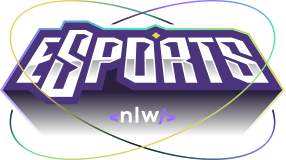

<p align="center">
  
  <br>
  <br>
  <hr />
</p>
  <p align="center">
    Um projeto desenvolvido durante a 7º edição do NLW (Next Level Week) da Rocketseat
  </p>

<br>

<p align="center">


    

</p>

# Sobre o projeto
O projeto trata-se basicamente de uma plataforma que tem como objetivo conectar pessoas por meio de anúncios, criados pelos próprios usuários, para jogarem. A criação de anúncios ficou exclusiva para a aplicação web e a parte de conexão ficou exclusiva para a aplicação mobile. Ainda pretendo desenvolver todas as funcionalidades para ambas as plataformas.

<br>


# Tecnologias utilizadas
- React
- Radix UI
- Tailwind CSS
- React Native
- Expo
- Node.js
- Prisma
- SQLite


# Inicialização
## Server
entre na pasta `server` presente no diretório raiz, e rode o comando para instalar as dependências:
```bash
npm i
```
Agora para criar o banco de dados, rode o comando:
```bash 
prisma migrate dev
```
Por fim para iniciar o servidor, rode o comando:
```bash
npm run dev
```

## Web
Para rodar o projeto web, entre na pasta `web` presente no diretório raiz, e rode o comando para instalar as dependências:
```bash
npm i
```
Agora para iniciar o projeto, rode o comando:
```bash
npm run dev
```
> Atenção: não esqueça de iniciar o servidor antes de iniciar o projeto web

## Mobile
Para rodar o projeto mobile você precisará baixar o app [Expo Go](https://expo.dev/client).
Apos baixar o app, basta ler o seguinte QR Code:
<p align="center">
  
</p>

Ou se preferir rodar localmente, entre na pasta `mobile` presente no diretório raiz, e rode o comando para instalar as dependências:
```bash
npm i
```
Agora para iniciar o projeto, rode o comando:
```bash
expo start 
```
> Atenção: não esqueça de iniciar o servidor antes de iniciar o projeto mobile, mesmo que não esteja rodando localmente